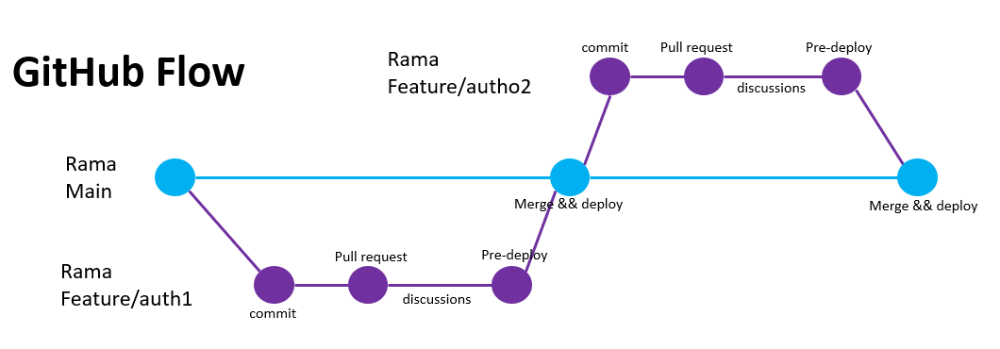

# github flow 
Github flow es el flujo de trabajo que sigue un equipo tomando como raiz el repositorio remoto
Simplemente se siguen los siguientes pasos:

## pasos a seguir:
1. Crear una rama ``feature`` de la rama principal  ``master o main``.
2. Hacer los cambios necesario en la rama creada.
3. Realizar los ``commits`` necesarios.
4. Hacer un ``pre-deploy`` en el cual puedes probar hacer testeo antes de enviarlo a la rama principal.
5. Luego de que todo este funcionando correctamente realizar un ``pull request`` a la rama main o master.
5. Recibe un `feedback o comentarios` de los demas integrantes del equipo de trabajo y en conjunto verificar si todos estan de acuerdo con los cambios.
6. Si todo esta bien el cambio sera aceptado y se podra fusionar o realizar un ``merge`` a la rama main o master.

## Flujo del trabajo de github flow
 

## #Dia19LearningGit