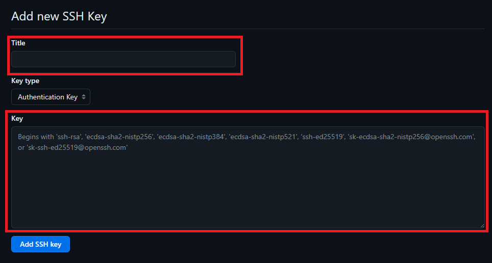
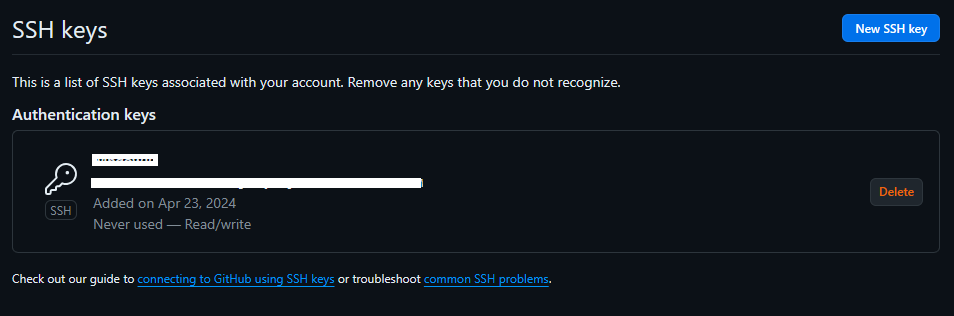
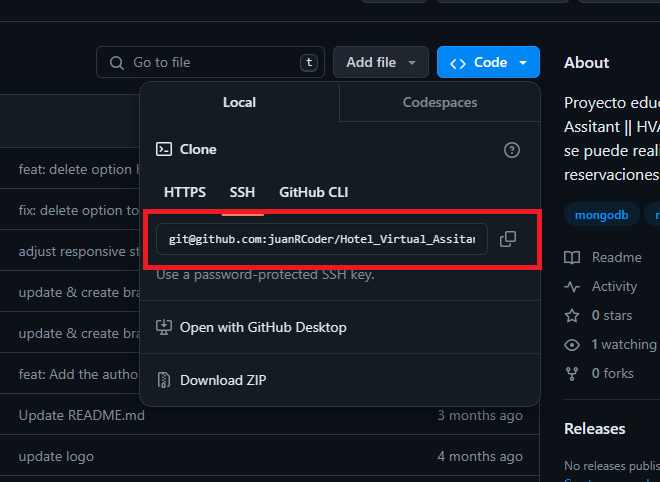

# autenticacion SSH en GitHub
SSH(security Shell), es una manera segura de acceder a un repositorio alojado en github.

## Porque usar SSH?
SSH se centra en la administración remota segura de sistemas y la transferencia de archivos, HTTPS se centra en la transferencia segura de datos a través de la web. 

Ambos protocolos son esenciales para garantizar la seguridad y la integridad de la comunicación en línea, pero tienen diferentes aplicaciones y enfoques.

## Pasos para generar una llave y clonar un repor con SSH
1. Generamos una llave SSH de manera local para poder utilizarlo.
```js
//Colocamos en nuestro gitbash
$ ssh-keygen -t rsa -C "username@gmail.com"
```

2. Vamos a la direccion donde esta la clave ssh.
```js
//Abrimos el archivo donde tenemos el archivo ssh
$ cat c:/Users/user/.ssh/id_rsa.pub
```

3. Una vez tengamos la llave ahora lo vinculamos con github.
4. Vamos a setting o la configuracion de github y seleccionamos la opcion. <br />``SSH and GPG keys``.

5. Y rellenamos estos datos:<br />
5.1 Colocamos un titulo para reconcer la SSH.<br />
5.2 Y agregamos la llave que copiamos en pasos anteriores.
<br/>

6. Y tendremos esto resultado una vez creado la llave.
<br/>

7. Copiamos el ssh para copiar el ssh del repo y clonarlo.
<br/>

8. Luego clonamos el proyecto.
```js
$ git clone git@github.com:[USERNAME]/[NAME-REPOSITORIO].git
```

9. Listo con esto ya habremos clonado nuestra repor con ssh.

## #Dia23LearningGit