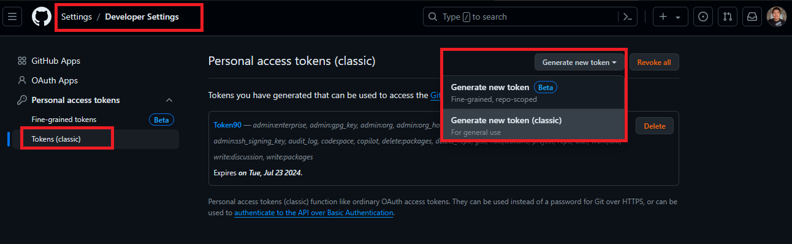

# Autentication del repositorio con token
Cuando hacemos un ``git push`` nos salta una advertencia ,no, el cual nos pide un permiso para saber si somos nosotros el `owner` del repositorio que esta enviando el cambio.

Esto puede ser molesto a la hora de enviar varios cambios o verificaciones al repositorio remoto. Pero podemos evitar esto autentiticando que somos nostros los que estamos enviando el cambio a travez de un `token`.

## Pasos para crear un TOKEN:
1. Nos dirigimos a  `settings/developerSettings`.
2. Luego seleccionamos la opcion `personal access token`.
3. Elegimos `tokens (classisc)`
4. Y generamos un nuevo token como en la imagen.
<br/>
5. Una vez adentro hacemos lo siguiente con cuidado.<br/>
5.1 Agregamos un `nombre al token`.<br />
5.2 Seleccionamos un `fecha de expiracion del token`. Es importante `darle una fecha por un tema de seguridad` ya que es como tu llave de tu casa el cual solo tu tendras acceso.<br />
5.3 Luego de eso `marcamos todas las casillas de verifications y permisos` para obtener todos los permisos posibles y acceder a todo lo de github con el token.
6. Despues de todo esto `generamos el token` y nos mostrara una ventana con el token el cual `debes copiar el token y guardarlo`.


Listo con estos pasos ya habremos creado y podemos clonar nuestros proyectos con el siguiente formato incluyendo el token.
```js
$ git clone https://{YOUR_PERSONAL_TOKEN}@github.com/{YOUR_USERNAME}/{YOUR_REPO}.git                  
```

Con esto ya no nos pediran permiso porque el repo lo estamos creando con nuestro token propio y nos reconocera como `owner`.

## #Dia24LearningGit