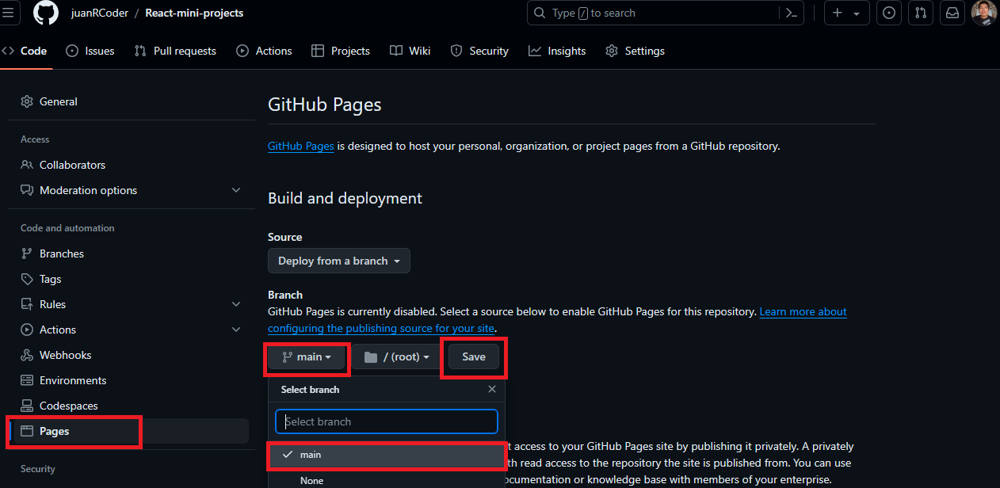
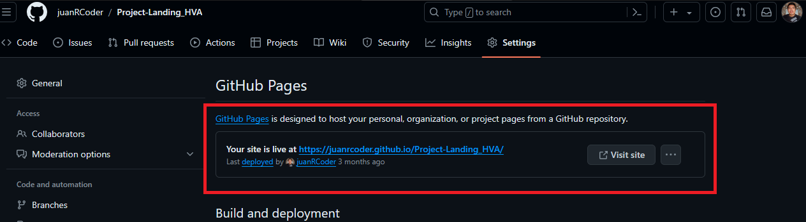

# GitHub Pages
Github ofrece una forma de desplegar el proyecto alojado en un repositorio, en una pagina web publica estatica y se pueda compatir o ver el trabajo.

#### OJO: debes tener el ARCHIVO.HTML en el raiz del proyecto para que funcione todo.

### Pasos para desplegar
```js
//Debes subir tus archivos a github con lo siguiente
- git add [files]
- git commit -m '[commit]'
- git push origin main
```
Luego nos dirigimos a `settings/pages` y hacemos lo siguiente.
<br/>

Despues de esto nos aparecera un mensaje el cual nos indica que habremos desplegado con exito y esperamos unos minutos.

Luego de eso volvemos a `setting/pages` y nos aparecera el enlace de nuestra pagina web de esta manera.
<br/>

# github actions
Github actions nos permite automatizar tareas despues de pushear como seria un despliegue de paginas, revision de tests.
Estos archivos se almacenan en la carpeta `.github/workflows` en un `archivo.yml`.

En este caso hemos hecho un automatizado sencillo para desplegar 2 paginas web del repositorio.
```yml
## learn-github-actions.yml

# Nombre del archivo
name: Deploy to GitHub Pages

# Iniciar la accion despues de cada push en la rama main.
on:
  push:
    branches:
      - main

# Grupo de trabajo 1
jobs:
  # Nombre del grupo deploy y que se ejecutara en ubuntu-latest
  deploy:
    runs-on: ubuntu-latest

    # Pasos para desplegar
    steps:
      #Acceso al codigo
      - name: Checkout code
        uses: actions/checkout@v2

      # Despliegue y creacion de una rama para el deploy
      - name: Deploy to GitHub Pages
        uses: peaceiris/actions-gh-pages@v3

        # Agregar opciones para deployar como el token y la direccion del html
        with:
          github_token: ${{ secrets.GITHUB_TOKEN }}
          publish_dir: ./

      # Despliegue2 y creacion de una rama para el deploy2
      - name: Second deploy to GitHub Pages
        uses: peaceiris/actions-gh-pages@v3

        # Agregar opciones para deployar como el token y la direccion del html
        with:
          github_token: ${{ secrets.GITHUB_TOKEN }}
          publish_dir: ./src/dashboard
```
Esto es una instruccion automatizada que nos ahorra tiempo en despliegeue y pruebas.

## #Dia25LearningGit