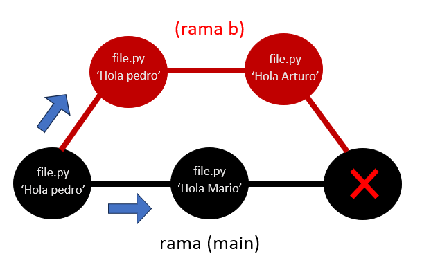

# merge conflicts:
A mas de uno le habra pasado que ha tenido problemas al combinar ramas como por ejemplo que otro desarrollador halla estado trabajando en la rama principal y cuando nostros hagamos un merge con los cambios hechos en nuestro archivo haya un error.

### grafico de un merge-conflict:
<br/>
Podemos ver como un hay dos cambios en el saludo del archivo, uno en la rama main y otro en la rama b.

### Solucion:
podemos resolver el problema colocando combinando ambas partes de lo sarchivos.
```py
 #<<<<<  HEAD (current change)
 saludo = 'hola' + nombre  + ', Como estas?'

=======

 saludo = 'hola' + nombre
 #>>>>> conflict-branch (incoming change)
```

Cuando ese problema aparece podemos darle a la opcion `resolve merge` y fusionar ambas ramas, agarrando lo mejor de cada uno y resolver.

## #Dia7LearningGit